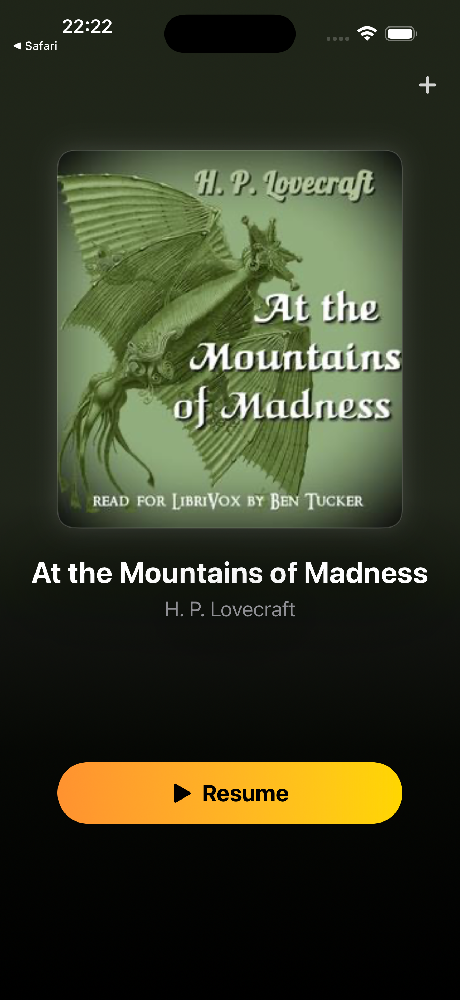
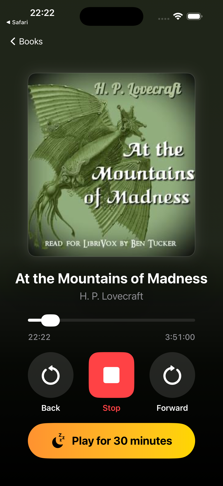

# Easy Audiobook

An audiobook player for iOS built around simplicity and accessibility.

<p align="center">
  
  &nbsp;&nbsp;
  
</p>

## Why this exists

I built this for my dad. He's partially sighted and has poor motor control, but he still loves listening to books. I tried a bunch of audiobook apps and they were all too busy, too fiddly, or had text and buttons that were way too small for him to use comfortably.

He doesn't need playlists or a store or social features. He needs big buttons, a simple layout, and something that remembers where he was when he falls asleep halfway through a chapter.

The app has a URL scheme so I can manage his library remotely. I can send him a new book or free up space on his phone without having to talk him through it. He just has to tap a link.

## Design Principles

The whole app is two screens: your library and the player. There are no tabs, no hamburger menus, no nested settings. Controls are large and high contrast. The sleep timer and skip durations are configurable through the iOS Settings app so the main interface stays clean and uncluttered.

Position is saved constantly. If the app gets closed, the phone restarts, or he just falls asleep, he picks up exactly where he left off.

Books can be added and removed remotely via URL schemes and Shortcuts, which is useful if you're managing the device for someone else.

## Features

- Large, high-contrast UI designed for users with impaired vision or limited motor control
- Supports MP3, M4A, and M4B audio formats
- Reads title, author, narrator, and cover art from M4B file metadata automatically
- Also reads metadata from .nfo files for MP3-based audiobooks
- Sleep timer with configurable duration (default 30 minutes)
- Configurable skip forward/back duration (default 2 minutes)
- Downloads and extracts audiobooks from RAR, ZIP, 7z, TAR, and GZ archives
- Background gradients adapt to the book's cover art
- Position saved automatically across app restarts
- Remote library management via URL schemes

## Adding Books

1. **In-app** tap the + button to import audio files or archives
2. **Files app** copy audiobook folders into Easy Audiobook's Documents directory
3. **URL scheme** send `easyaudiobook://download?book=<URL>` to download a book remotely
4. **Open In** share audio files or archives from other apps

Single audio files like a bare .m4b are automatically wrapped into their own folder.

### Folder Structure

```
My Audiobook/
  cover.jpg          # optional cover art
  info.nfo           # optional metadata (Title, Author, Read By, Description)
  Chapter 001.mp3
  Chapter 002.mp3
  ...
```

M4B files with embedded metadata don't need a cover image or .nfo file. The app reads everything from the file itself.

## URL Schemes

These work from Safari, Shortcuts, or any app that can open URLs. Useful for managing someone's library remotely.

| URL | Action |
|-----|--------|
| `easyaudiobook://download?book=<URL>` | Download and extract an audiobook archive |
| `easyaudiobook://deleteall` | Stop playback and remove all books |

## Settings

Open **Settings > Easy Audiobook** to configure:

- **Skip Duration** how far the back/forward buttons jump (default 2 minutes)
- **Sleep Timer Duration** how long the sleep timer runs before stopping (default 30 minutes)

Settings live in the iOS Settings app to keep the main interface simple.

## Requirements

- iOS 17.0+
- Xcode 15+

## Building

Open `EasyAudioBook.xcodeproj` in Xcode and build for your target device or simulator.
